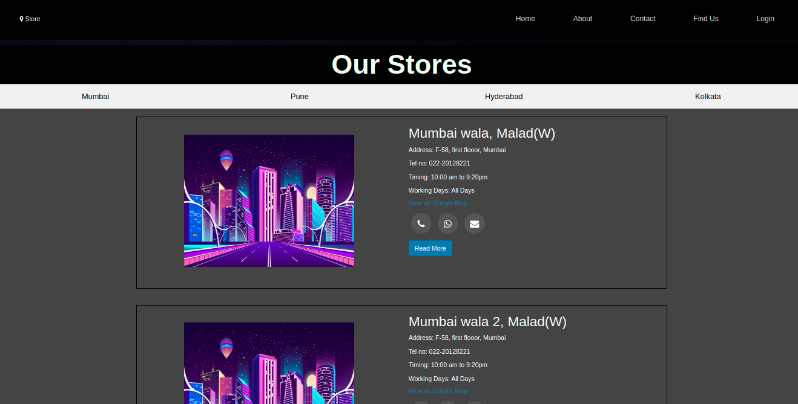
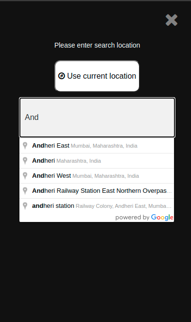
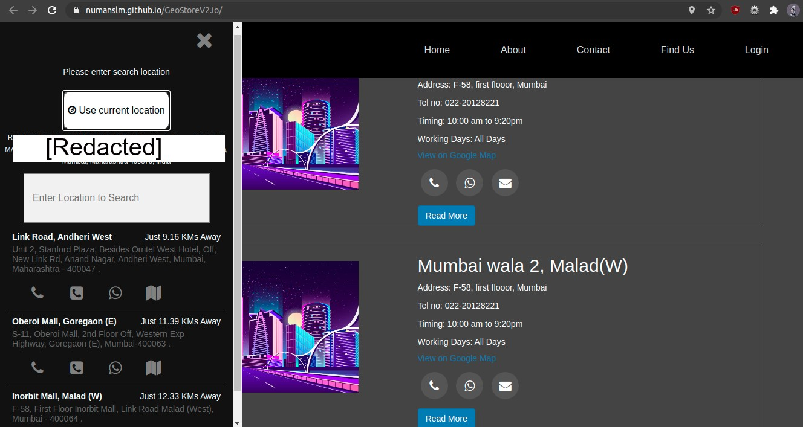
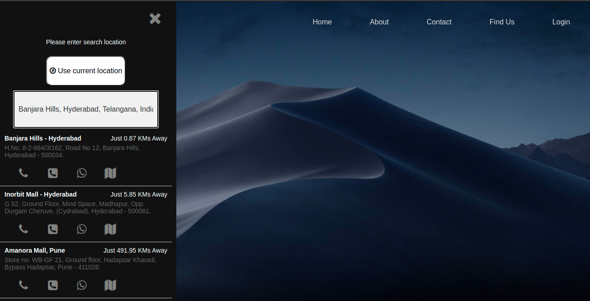

# GeoStoreV2

GeoStore is a store locator which helps to locate the nearest stores based on user's input or his current location automatically.

#

### Requirements:
You need a Google API key with billin enabled for the API access to work ! [Get your Key here](https://developers.google.com/maps/documentation/javascript/get-api-key)

### Working Methodology:
In this project a list of store list has been provided along with all the information regarding each store, the information for each store is different.
If the traditional approach were to be implemented, it would involve a lot of 'hard code' to be used, hence the store list has been converted to a json which contains the location of the brand's stores along woth other details such as contact information and operational information.

#
## Process:
On Window load, a prompt is displayed which asks for the users consent to access their location,

Upon allowing this access, the store automatically selects the zone(Mum,Pun,Hyd,Kol) in which the users location falls in and displays the stores-list in users zone.

Also, if at this point if the user does not wish to share his location before browsing the website, he can click on the "Store" button in NavBar to launch a dedicated store loactor
### Here the user has 2 options:
<ol>
<li>Use Your Current Location</li> 
<li>Use Search Bar to search for stores which are closer to the queried location</li>
</ol>

#
<ul>
<li>For Getting User's 'Current location' , we use 'GeoLocation API' which returns their current postion in Latitude, Longitude.

In order to convert these cordinates to human interpretable location, ReverseGeocoding is used which takes in (lat,long) as arguments and returns the location in a formatted manner.
</li>
<li>
Based on this returned data, we apply Euclidean Distance Algorithm and calculate the distance between the list of stores to return the top "n" queries. Now, it is important to convert the distance to your preffered unit of measurement, hence cosine distance is used here to convert distance to KMs
</li>
<li>
Now, if the user wishes to do a manual search, he can do so by using the search bar which uses the Google Maps, places API which is fired for every 'keyup' keyboard event
</li>

#
## Result:

Users Location Via Button 

Via Search Location Field

